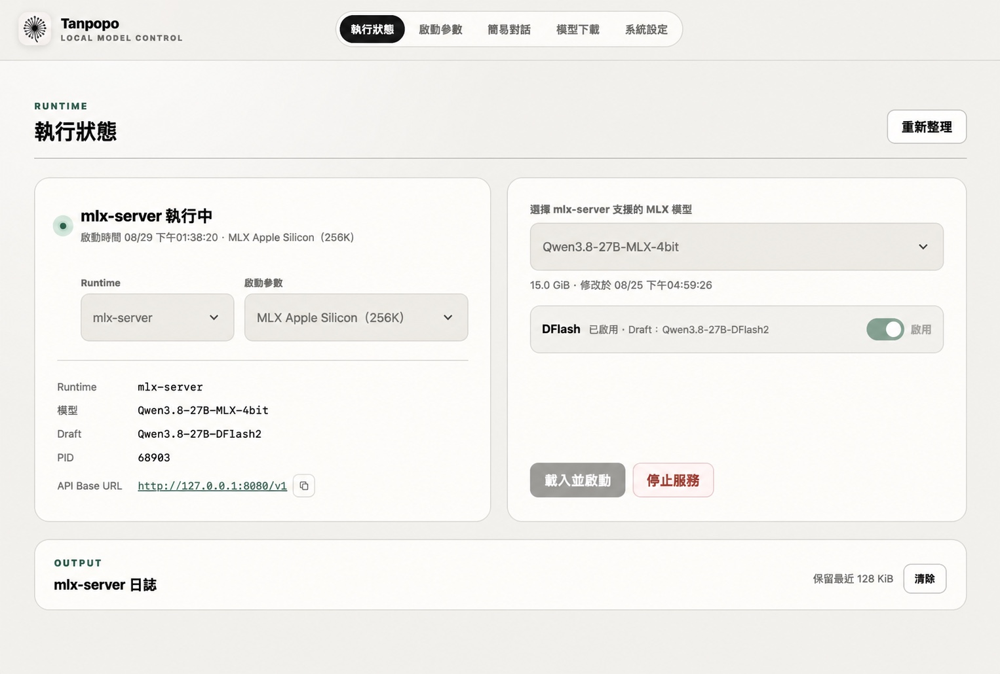

# Tanpopo

[繁體中文](README.md) · [English](README.en.md) · [日本語](README.ja.md) · [한국어](README.ko.md)

`Tanpopo` 是一個以 Go 實作的本機模型服務管理器；名稱取自日語「蒲公英（たんぽぽ）」，象徵模型把生成的 Token 像種子般向外散發。管理介面提供簡單登入、模型服務管理與暫存式簡易對話；`llama-server` 維持跨平台與 GGUF 高相容性，Apple Silicon 另提供原生 Swift／MLX 的 `mlx-server`，支援文生文與多模態模型。



## 主要功能

- 本機帳號密碼登入；首次啟動後應立即變更範本提供的初始登入資料，也可在系統設定經確認後關閉登入驗證，不建立使用者資料庫。
- llama-server 與 mlx-server Runtime 由部署包自動安裝、解析與版本管理，不需設定執行檔目錄。
- GGUF 模型目錄預設為 `~/services/models`，MLX 模型目錄預設為 `~/services/mlx-models`，兩者都可在系統設定調整。
- 支援 Hugging Face 公開、gated 與 private repository 的 GGUF 單檔或完整 MLX 模型下載。
- 模型下載頁提供 JSON 驅動的常用模型快速選單；GGUF 與 MLX 各自依 8B 級、30B 級、70B 以上分群，群內按模型名稱字母排序。選取後會自動填入 Runtime、Repository、Revision 及適用的 GGUF 檔名；清單獨立保存於 `website/assets/popular-models.json`，不寫死在前端程式。
- 下載中心可搜尋 Hugging Face Repository，依下載數、讚數或字母排序；支援持久化「我的最愛」。GGUF 檔名改由 Repository 掃描結果選取，優先選擇 `Q4_0`，沒有則選排序第一項，並提供重新掃描按鈕。
- 大型檔案在伺服器支援 Range 時以 64 MiB 區塊、最多 4 個並行工作下載；不支援時自動退回單一串流。管理畫面會顯示佇列、位元組數與進度，完成項目會自動清除；桌面 App 另可直接開啟儲存位置，瀏覽器模式會停用該按鈕。
- 自動掃描模型目錄及其子目錄內的 `.gguf` 檔案與完整 MLX 模型目錄；Apple Silicon 的 `mlx-server` 可直接載入支援的 GGUF，不必先轉換成 safetensors。
- **快速GGUF模式（Fast GGUF）**在 `mlx-server` 選擇 GGUF 時預設開啟，以模型名稱無關的 tensor 能力規則選擇 INT4、INT8、BF16 與 Group，並持久保存為 `.fgguf`，避免重複轉換。系統設定提供 Mode 1（均衡・預設）、Mode 2（較高精度）與 Mode 3（最快）三種策略；這套通用機制對多數可由 mlx-server 解析的 GGUF 都有幫助，但不保證每個架構、量化格式或自訂 checkpoint 都能載入、加速或維持相同精度，正式使用前仍應實測。
- 執行狀態頁依所選 Runtime 提供按字母排序的模型下拉清單，GGUF、MLX 與 mmproj 統一以「模型名稱（目錄名稱）」顯示，但實際提交值仍為完整安全路徑。非 macOS 平台會在啟動時直接隱藏 Apple Silicon 專用的 mlx-server 選項。
- KV Cache、MMap、DFlash 與 MTP 採全流程整合：涵蓋系統功能預設、啟動 Profile、執行開關、相容性預檢、Runtime 參數、狀態保存與錯誤回報。實際可用性仍依 Runtime 與模型能力決定；DFlash／MTP 推測解碼不可彼此並用，也與 KV Cache 量化互斥。
- 執行狀態頁將 DFlash 與 MMap 收納於「進階設定」泡泡；兩者仍為獨立開關，不會隨功能增加而持續拉長頁面。
- DFlash 預設關閉；不支援的 Target 會禁用開關，勾選時會即時重新掃描並檢查配對 Draft。MMap 同樣預設關閉，同時支援 `llama-server` 與 Apple Silicon `mlx-server`，啟用後可利用磁碟分頁降低載入模型時的記憶體壓力。
- 系統設定提供服務主機目錄瀏覽器，可由 Home、檔案系統或掛載磁碟選擇 GGUF／MLX 模型目錄，不需要作業系統 Automation 權限或外部工具。
- 可建立多組啟動參數並指定 `llama-server` 或 `mlx-server` Runtime，執行時才與選定模型動態組合。
- 內建 256K Context 的一般、KV Cache Q8、KV Cache Q4、強制關閉思考、MTP 與 DFlash 啟動 Profile；Apple Silicon 另有原生 MLX DFlash 1／2 與 MLX MTP Profile。
- 可啟動、停止並查看目前模型 Runtime 的 PID、URL 與最近 128 KiB 日誌。
- 按下「載入並啟動」會立即顯示模型載入提示，提醒大型模型可能需要轉換並耐心等候；Runtime 執行後可進行單次測試、重複 3 次測試或至少 500 個輸出 Token 的長輸出測試。重複測試會顯示平均值與中位數，所有模式都會列出 Token、生成速度、測試時間與明確失敗原因。
- 效能校準可複選 GGUF／MLX 模型，自動選擇適用的 Server，顯示逐項測試進度、結果與建議配置；另可選用啟動前的記憶體壓力保護。
- 成功啟動後會保存 Runtime、Profile、模型、mmproj、DFlash 與 MMap 選擇；關閉 Tanpopo 再開啟時，不需登入即可先自動恢復模型服務。使用者明確按下停止則不會自動恢復。
- 簡易對話支援 Markdown 與本機數學公式渲染；模型有提供 reasoning、`<think>` 區段或 `<|channel|>` 思考通道時，會與最終回答分開顯示。思考過程在生成期間預設展開並顯示三點動畫，完成後自動收合；同時顯示輸入／輸出 Token 與每秒輸出 Token 數。
- 管理介面支援 `AUTO`、繁體中文、英文、日文與韓文；選擇會保存於本機設定，`AUTO` 依作業系統及瀏覽器語系決定。
- 介面提供蒲公英、晴空藍、櫻花粉與深夜紫四種配色，其中深夜紫為深色主題；切換後立即預覽並保存。
- 視窗底部狀態列每 3 秒更新 CPU、GPU、MEMORY 與網路狀態，使用率依 50%／80% 分為低彩度綠、黃、紅三個區間。內框捲軸不與標題或狀態列重疊，停止捲動後會淡出。
- 「系統設定 → 系統資訊」以唯讀方式顯示作業系統、Kernel、架構、主機名稱、CPU、GPU、記憶體、網路介面與目前可供其他裝置使用的管理網址；不顯示 loopback 管理網址。
- APP 啟動時及每小時會檢查 GitHub 最新正式 Release；版本比較包含同日發布的 build 編號。Linux 可在「系統設定 → 關於」上傳正式發布 ZIP，驗證後自動更新並重新啟動服務；此功能要求管理登入驗證已開啟。
- 原生選單與「系統設定 → 關於」會顯示 `1.YY.MMDD build HHmm` 版本、目前可達的管理頁面網址、可複製的模型 API `/v1` URL，以及 GitHub 快速連結；本機 `127.0.0.1` 管理網址不列入公開資訊清單。
- llama-server 與 mlx-server 直接監聽 Profile 指定的 Host／Port，兩個 Runtime 內部使用同一份 Tanpopo 安全策略快照驗證請求，不增加反向代理層。
- 模型 API 可選擇不限制、只使用核發金鑰、只使用 IP 白名單，或同時使用兩種限制。
- 系統設定提供選用的 NetPass 反向代理頁面；只有管理介面帳密驗證及模型 API Access Key 驗證都已開啟時才能建立公共網址，任一防護關閉會立即停止連線。頁面會明確警告此功能將本機暴露於公共網路，沒有確切目的不應開啟。
- 設定保存採原子替換；Hugging Face Token 與模型 API 金鑰不會由設定 API 回傳明文。
- 系統設定頁的開關、下拉選單與配色變更後自動儲存，保留原儲存按鈕；不連帶提交未完成的文字欄位，儲存失敗時會還原選項並顯示錯誤。
- macOS 圖形工作階段會以原生 AppKit／WKWebView 視窗載入管理介面，不啟動外部瀏覽器；可啟用常駐模式，在系統選單列重新顯示視窗或完整結束服務。Linux、SSH 與 headless 工作階段維持 Shell 模式。

## 公開測試報告

- [模型相容性報告](https://vaderchen.github.io/Tanpopo/reports/model-compatibility.html)：整理原生 MLX、MLX 直讀 GGUF、llama.cpp GGUF、多模態投影、KV Cache 量化與推測解碼的支援範圍及相容性邊界。
- [MLX 與 GGUF 轉換的載入速度及運算精確度](https://vaderchen.github.io/Tanpopo/reports/performance-comparison.html)：以 4B、9B、27B 配對模型比較原生 MLX、llama.cpp + GGUF、MLX + Fast GGUF Mode 1／2／3，如實列出固定 100 題結果、生成速度、Fast GGUF 容量及程序 RAM。

兩份 HTML 均可切換 `AUTO`、繁體中文與英文。報告數據是標示日期、硬體、Runtime 版本與樣本下的可重現測試快照，不代表所有模型或裝置都會得到相同結果，也不構成 Fast GGUF 的相容性、速度或精度保證。

## 快速啟動

開發模式需要 Go 1.25 以上、CMake 與 C/C++ 工具鏈；建立 mlx-server 另需 Swift 6／Xcode。部署包會攜帶固定版本的 `llama-server` 與 Apple Silicon `mlx-server` Runtime，不需要另外下載 llama.cpp、MLX Server 或 Python。

```bash
cd /path/to/Tanpopo
./run.command
```

`run.command` 會先呼叫 `build.command --runtime` 檢查目前平台的開發用 Runtime。版本相符且原始碼沒有更新時才直接沿用；缺少、版本不符或原始碼較新時，會由專案內鎖定的原始碼重新編譯 `llama-server`，Apple Silicon 也會一併處理 `mlx-server`，完成後才啟動 Go Service。Linux 不會嘗試編譯 Apple Silicon 專用的 MLX Runtime，正式安裝包則會檢查並安裝 Vulkan 建置相依套件，再建立或啟用 Vulkan Runtime。

在本機 macOS 圖形登入工作階段，服務開始監聽後會自動彈出原生管理視窗，載入目前 Session 對應的登入頁或主畫面，不會呼叫 Safari、Chrome 等外部瀏覽器。系統設定的「常駐」預設關閉；切換開關時會立即獨立保存，開啟後 Tanpopo 會出現在系統選單列，關閉視窗只會隱藏 UI，Go Service 與模型 Runtime 繼續在後台執行。可從選單列重新顯示視窗，或選擇「結束 Tanpopo」完整停止服務。常駐關閉時，關閉視窗仍會正常停止 Go Service。Linux、SSH、無圖形登入工作階段及其他未提供原生 UI 的平台，會維持現有 Shell 前景執行方式。可用環境變數明確覆寫模式：

```bash
TANPOPO_UI=shell ./run.command  # 強制 Shell
TANPOPO_UI=gui ./run.command    # 支援平台強制開啟原生視窗
```

Tanpopo 的 APP 版本採用 `1.YY.MMDD build HHmm`。`run.command`、`run.sh`、`build.command` 與 `pack.command` 都會直接以 `Asia/Taipei` 的當日日期產生 `1.YY.MMDD`，並以執行時間產生 `build HHmm`；不讀取、不驗證，也不改寫根目錄 `VERSION`，跨日執行或重封裝不需要手動修改任何日期。只有要刻意重製歷史版本時才應設定 `TANPOPO_VERSION`，需要固定 Build 時則可設定 `TANPOPO_BUILD`；產出的部署包會寫入本次實際版號，GitHub Tag 使用 `v1.YY.MMDD-build-HHmm`。程式啟動後會立即查詢 GitHub 最新正式 Release，之後每小時重新檢查；版本與 build 都會參與比較，因此同一天的後續 Release 仍可被偵測。同一個介面工作階段對同一新版只通知一次，Draft 與 prerelease 不列入最新版。

如需強制重編兩個模型 Runtime，可執行：

```bash
TANPOPO_REBUILD_RUNTIMES=1 ./run.command
```

首次啟動會由 `agent.sample.properties` 建立 `agent.properties`。管理服務預設監聽 `0.0.0.0:10082`，本機可使用：

```text
http://127.0.0.1:10082
```

區域網路內其他裝置可使用 `http://<主機區網 IP>:10082` 連線；實際可達範圍取決於主機防火牆與路由設定。

初始登入資料由 `agent.sample.properties` 提供，僅供第一次本機啟動使用；正式使用、開放區域網路或啟用反向代理前必須先變更。可在「系統設定」即時修改管理帳號與密碼；保存後會撤銷所有既有 Session，並要求使用新帳密重新登入。登入欄位會優先提示瀏覽器使用英數鍵盤，但不限制帳號密碼字元。「記住我」未勾選時使用只存在記憶體的瀏覽工作階段 Cookie；勾選後則建立以目前帳密衍生金鑰簽章的持久 Cookie，可跨 Tanpopo 服務重啟驗證，帳號或密碼一旦變更便立即失效。網站儲存空間不會保存帳號或密碼。

## llama-server Runtime

本專案只管理 `llama-server`，不會把 llama.cpp 函式庫直接連結進 Go 程序。部署包會同時保存自訂 llama.cpp 的固定版本號、可建置原始碼，以及封裝時可取得的下列預編譯 Runtime：

- macOS Apple Silicon（`darwin/arm64`，Metal）
- Linux x64（`linux/amd64`，Vulkan）

封裝器會自動建立目前主機平台的預編譯 Runtime；其他平台的預編譯檔若不存在則直接略過，不會讓封裝失敗。Linux 發布包包含 `build-llama-server.sh`、精簡 llama.cpp 原始碼及 Vulkan 相依套件檢查器；安裝時會依發行版安裝缺少的編譯工具、Vulkan headers／shader compiler，並處理 GPU 裝置群組權限。沒有預編譯檔時會在目標主機原生建立 Vulkan Runtime。

```text
~/services/llama.cpp/versions/<llama-server-version>/<platform>/bin/llama-server
~/services/llama.cpp/current -> versions/<llama-server-version>/<platform>
```

Runtime 位置不再由管理介面設定。後端會依序從部署包內的預編譯目錄、安裝後的 `current` 版本、開發專案的 Runtime 目錄與系統 PATH 尋找 `llama-server`。一般部署只需執行 `install.sh`，不需要手動填寫路徑。

```text
<部署包>/llama-server/prebuilt/<platform>/bin/llama-server
~/services/llama.cpp/current/bin/llama-server
<開發專案>/llama-runtime/prebuilt/<platform>/bin/llama-server
```

啟動模型時，Tanpopo 會把 Profile、模型與安全策略快照路徑動態組合後，直接讓 llama-server 監聽 Profile 指定的 Host／Port。實際命令概念如下：

```bash
llama-server \
  --model /完整路徑/model.gguf \
  --mmproj /完整路徑/mmproj-model.gguf \
  --host 0.0.0.0 \
  --port 8080 \
  --ctx-size 262144 \
  --n-gpu-layers -1 \
  --openloader-access-control <安全策略快照>
```

對外 Runtime 直接使用 Profile 設定的 Host 與 Port；執行狀態頁會顯示並可複製 OpenAI 相容 Base URL，例如 `http://<主機 IP>:8080/v1`。一般 HTTP、OpenAI 相容 API 與 SSE 回應都由 llama-server 直接處理。

管理介面的「啟動參數」可保存多組參數 Profile。執行狀態頁選定 Profile 與 GGUF 後，Go 後端才會動態組合命令列並直接啟動 `llama-server`，不會產生或執行 `.sh`。Profile 的「額外參數」採每行一個 argument，例如：

```text
--flash-attn=on
--jinja
```

多模態模型可在執行狀態頁另外選擇檔名含 `mmproj` 的 GGUF。後端會在模型目錄內安全解析檔案路徑，並於啟動時加入 `--mmproj <完整路徑>`；純文字模型可保留「不使用 mmproj」。詳細行為請參考 [llama.cpp 多模態說明](https://github.com/ggml-org/llama.cpp/blob/master/docs/multimodal.md)。

內建 Profile 的 Context Size 均為 256K（`262144`）。Profile 可直接選擇 KV Cache Q8 或 Q4；執行狀態頁的獨立 Switch 決定本次啟動是否套用，關閉時維持未量化，llama-server 開啟時會轉成 `--cache-type-k` 與 `--cache-type-v`。DFlash 與 KV Cache 量化互斥，介面與後端都會阻止兩者同時啟用。「強制關閉思考」同時設定 `--reasoning off`、`--reasoning-budget 0` 與 `--jinja`；MTP 使用主模型內建的 MTP heads，不需要 Draft GGUF。DFlash 預設關閉；勾選後才會把配對的 Draft 與 Target 動態組合，llama-server 會加入 `--model-draft` 與 `--spec-type draft-dflash`。若 Draft 不存在，畫面會取消勾選並提示前往「模型下載」；啟動時後端仍會再次驗證路徑與架構。參數格式以 [llama-server 選項](https://github.com/ggml-org/llama.cpp/blob/master/tools/server/README.md)與 [llama.cpp speculative decoding 說明](https://github.com/ggml-org/llama.cpp/blob/master/docs/speculative.md)為準。

MMap 位於執行狀態頁的「進階設定」泡泡，是獨立且預設關閉的低記憶體開關，同時支援 `llama-server` 與 Apple Silicon 的 `mlx-server`。llama-server 開啟時使用 `--load-mode mmap`，mlx-server 則將可直接映射的 safetensors 或 GGUF 權重包裝成檔案頁面；後端會先移除 Profile 中衝突的舊參數，確保 Switch 與實際行為一致。啟動參數可選擇自動或 4、8、16、24、32、48、64、96、128 GB 的 MMap 記憶體保留目標。llama-server 會透過 `--fit-target` 自動配置 GPU Layers；mlx-server 會把實體記憶體扣除保留目標後的空間作為 MLX 配置目標。此數值不是 Runtime 的硬性使用上限。MMap 可讓作業系統按需從磁碟載入模型頁面，但模型大幅超過實體記憶體時，首 Token 與生成速度仍會受儲存裝置及分頁頻率影響。

## mlx-server Runtime

`mlx-server` 是本專案內建的 Apple Silicon 專用執行檔，核心載入方式參考 MangaKitchen，直接使用 MLX Swift：

- 文生文模型：`LLMModelFactory`
- 多模態模型：`VLMModelFactory`
- GGUF 模型：內建 GGUF metadata、Tokenizer 與量化權重轉換器
- HTTP Server：SwiftNIO

整個應用不呼叫 Python、`mlx_lm.server`、pip 或虛擬環境；Go 管理服務與 Swift MLX Runtime 都是原生執行檔。部署主機不需要安裝 Python。

啟動時可直接使用完整 MLX 模型目錄，或從一般 GGUF 模型目錄選擇 GGUF 檔案。MLX 目錄會由 `config.json` 自動判斷文生文或多模態架構，再載入 safetensors、Tokenizer 與 Processor；若衍生 checkpoint 保留 Vision 設定但未提供 Processor 檔案，會退回文字模型載入。支援型別由內建 `mlx-swift-lm 3.31.4` 註冊表動態回報，包含原生 Gemma 4 多模態模型。GGUF 則會優先使用檔案內嵌的模型設定與 Tokenizer，並在 MLX 載入階段轉換支援的量化權重；目前 Runtime 回報的直載架構為 Gemma、Llama、Mimo、MiniCPM、Mistral、Qwen2、Qwen3、Qwen3.5 與 SmolLM3。其他掃描到的語言模型會顯示在可選取的「尚未測試」群組；啟動時會交由 mlx-server 實際載入，若不相容則回報既有的失敗原因。管理頁會以 `MLX`／`GGUF` 標示來源，並以獨立路徑前綴避免兩個模型根目錄的同名項目互相覆蓋。GGUF 同目錄若有且只有一份可配對的 `mmproj`，mlx-server 會自動掛載；完全沒有 `mmproj` 時則當作純文字 LLM 載入，存在多份候選時不會猜測配對。

**快速GGUF模式（Fast GGUF）**是 mlx-server 的通用 GGUF 最佳化入口，選擇 GGUF 時預設開啟。系統設定的獨立「快速 GGUF 策略」卡片同時保存預設開關與策略選擇：

- **Mode 1（均衡・預設）**：K-Quant super-block 沿用來源 4-bit block，該張量固定 Group 32；其餘低位元張量使用 Group 64。
- **Mode 2（較高精度）**：低位元來源重新量化為 INT8／Group 64，採較保守的數值路徑。
- **Mode 3（最快）**：低位元來源重新量化為 INT4，策略固定 Group 32，不受手動 Group Size 參數影響。

關閉快速GGUF模式時改走 `auto + group auto + recurrent off` 的一般 GGUF 轉換。所有策略都只依 tensor dtype、shape、來源 block 與架構 metadata 判定，不依模型檔名寫特例；Q4_K 沿用區段的 32 元素 Group 是來源格式本身的 sub-block，不代表全域改用 Group 32。`--gguf-profile quality` 會使用 FP32 參考權重，只適合誤差診斷，不是一般效能模式。

Fast GGUF 的設計可套用於多數 mlx-server 能解析的 GGUF，不需要為每個模型寫特例；但它不是相容性或精度保證。模型架構、GGUF metadata、Tokenizer、tensor layout、量化方式與自訂修改都可能影響結果。DFlash 1／2 仍限定搭配 MLX safetensors Target 與相容 Draft；MTP 則支援相容的原生 MLX Target／Draft，以及包含可辨識 `nextn_predict_layers` 與預測層 tensor 契約的 GGUF 內嵌路徑。相容性由架構 metadata 與 shape 驗證，不依模型檔名判定。

GGUF 轉換後會建立 Tanpopo 內部的 Fast GGUF `.fgguf` 分片，並直接儲存在原始 GGUF 的同一目錄：逐 tensor 判斷是否採 LZFSE 無損壓縮，沒有足夠容量收益的 tensor 保持 raw 與 MMap 對齊。此格式不是標準 GGUF，也不供其他 Runtime 交換使用；完整位元組配置、索引、壓縮門檻與相容策略請參考 [Fast GGUF 格式](mlx-server/FGGUF-FORMAT.md)。既有 schema 2 safetensors 轉換產物仍可由管理介面辨識與移除。

「實驗性功能」提供預設關閉的「轉換後移除原 GGUF」。啟用時需確認永久刪除風險；只有 Fast GGUF 分片、manifest 與獨立啟動資產驗證完整，且模型服務已成功載入後才移除來源。來源 GGUF 不存在時，mlx-server 的模型清單會檢查可獨立載入的 Fast GGUF 作為 fallback，因此停止服務後仍可重新載入。新轉換使用 schema 4；舊 schema 3 需具備完整啟動資產，schema 2 不支援此 fallback。

Fast GGUF fallback 僅供 Apple Silicon 的 mlx-server 使用，仍分類於 GGUF；目前不支援 fallback 的內嵌 MTP。改用 llama.cpp、重新轉換或使用不相容策略時，仍需重新取得原始 GGUF。若移除最後一份 Fast GGUF 且來源也已刪除，就不再有可用模型；請先確認可重新下載的來源。

API 提供 OpenAI／llama-server 常用相容端點：

```text
GET  /health
GET  /v1/health
GET  /props
GET  /models
GET  /v1/models
POST /chat/completions
POST /v1/chat/completions
POST /v1/completions
POST /completion
```

`/v1/chat/completions` 支援 OpenAI 格式的文字 content、`image_url` 多模態 content parts，以及原生 `tools`、`tool_choice`、`message.tool_calls` 與工具結果訊息。`stream: true` 在完成格式、模型與生成名額檢查後便建立 OpenAI 相容 SSE，不等待 Tokenization 或 Prefill；建立時及之後每 10 秒送出保活註解，生成文字則隨 token 逐段輸出。保活與 assistant role chunk 不代表已有思考／回答文字，也不會消除長上下文的首 token 延遲。

HTTP 層在等待回應期間仍持續偵測斷線。客戶端實際中斷 HTTP 請求／回應串流時，會透過請求專屬取消訊號停止後續 Prefill／生成，不影響其他使用者；已提交 GPU 的當前運算仍需收尾，不保證整體 GPU 使用率立即歸零。同一連線的 Keep-Alive 與 HTTP/1 pipelining 依序回應，並限制等待佇列與緩衝容量。

MLX Runtime 的 SPEC 是支援多人並行，目前階段最多 4 個生成請求，第 5 個回傳 HTTP 429。長輸入在模型 forward 前檢查上下文與記憶體預算，必要時縮小本次 Prefill 分段，不截斷輸入、不改寫設定或校準紀錄；未宣告分段能力的路徑按完整輸入保守估算。非串流的上下文／預估記憶體超限回傳 HTTP 413，執行中記憶體超限回傳 HTTP 503；串流建立後的錯誤改送 SSE error。詳見 [MLX Runtime 規格](docs/MLX-RUNTIME-SPEC.md)及 [API 延遲與取消排查](docs/MLX-RUNTIME-TROUBLESHOOTING.md)。

`/models` 與 `/v1/models` 會回傳相同的目前載入模型，方便不同 Provider 客戶端自動取得正確 Model ID。模型 API 的金鑰與 IP 白名單由 mlx-server 自己在 SwiftNIO 請求入口執行。

內建 MLX Profile 包含一般、KV Cache Q8、KV Cache Q4、強制關閉思考、DFlash 1 Greedy 與 DFlash 2 Sampling。Profile 的量化選單決定 Q8 或 Q4，執行狀態頁的 Switch 決定本次是否啟用；開啟時 Go 後端會加入 `--kv-bits`、`--kv-group-size 64`、`--quantized-kv-start 2048`，並把 Context Size 轉成 `--max-kv-size`。KV Cache 量化與 DFlash 不可同時啟用。其他常用原生參數包含 `--kv-scheme`、`--prefill-step-size`、`--thinking` 與 `--no-thinking`。

KV Cache、MMap、DFlash 與 MTP 都是 Tanpopo 的一級功能，不是只在文件中提供的手動旗標。系統設定可保存各功能的模型預設，啟動 Profile 定義細節，執行狀態頁可針對本次載入覆寫；後端會做互斥與相容性檢查、組合正確參數、保存狀態並將失敗原因回傳介面。完整整合不代表每個模型都支援所有功能：KV Cache 格式與 MMap 行為受 Runtime 限制，推測解碼需要相容 Target／Draft 或 GGUF 內嵌預測層。

### 原生 MLX DFlash 1／2

MLX DFlash 是直接整合在 Swift Runtime 與專案內維護的 `mlx-swift-lm 3.31.4` fork，不會呼叫 Python。Target 與 Draft 都放在可設定的 MLX 模型根目錄下；執行狀態頁會依 Target 架構啟用或禁用 DFlash 開關，勾選後才會選取與 Target 配對的 Draft。實際啟動時後端才會解析安全的相對路徑並加入：

```text
--dflash-draft <Draft 模型完整目錄>
--dflash-block-size 5
--temperature 0
```

目前採用可驗證、可精確回退的實作範圍：

- 支援文生文 Qwen3 dense，以及相容的 Qwen3.5 hybrid Target；Draft 可為 `DFlashDraftModel` 或 `DFlash2DraftModel`。Qwen3.5 啟動時會明確使用文字模型路徑，不載入 Vision wrapper。
- DFlash 2 實作 grouped dynamic causal convolution 與 candidate path selector；selector 只保存 top-k sparse proposal probability，避免為每個位置保留完整 vocabulary 分布。
- Greedy 解碼使用精確 token 比對，結果與 Target Greedy 一致；Sampling 使用 exact rejection sampling，支援 temperature、top-p、top-k、min-p 與既有 penalty processor，保留 Target 條件分布。同一 seed 的 DFlash 與一般生成不保證逐 token 相同，因兩者消耗亂數的路徑不同。
- DFlash 2 搭配 Qwen3.5／Qwen3.8 hybrid Target 且使用 Greedy 時，會自動把有效 Block Size 限制為 2，避免 Gated Delta Net 多 token 與逐 token 浮點累積順序造成 argmax 分歧；Sampling 仍使用 Profile 設定的完整 Block Size。
- DFlash 1 Profile 的 Block Size 預設為 5，DFlash 2 Profile 預設為 8，且都不會超過 Draft checkpoint 的訓練值。
- Draft 支援 full attention 與 sliding attention；Qwen3.5 Target 的 Gated Delta Net cache 會先還原驗證前狀態，再只重播已接受的 prefix，attention KV 則移除被拒絕的 suffix。
- Target 僅使用可精確 trim／rollback 的一般 cache，不支援 rotating 或量化 target KV Cache。
- DFlash Profile 雖保留全域 256K Context 選項供介面一致性使用，但啟用 Draft 時不會傳入 `--max-kv-size`；實際可用上下文仍受 Target 模型設定與記憶體限制。
- 多模態 DFlash target 留待後續階段；未啟用 DFlash 時不影響既有多模態功能。

若單筆 API 請求覆寫為不支援的 Target cache 設定，`mlx-server` 會記錄原因並安全回退到同一 Target 的一般生成，不會用近似演算法冒充 lossless speculative decoding。生成日誌會輸出 proposed、accepted 與 acceptance rate，方便比較 DFlash 是否真的帶來效益。技術流程依據 [DFlash 論文](https://arxiv.org/abs/2602.06036)與[官方 MLX 參考實作](https://github.com/z-lab/dflash/blob/main/dflash/model_mlx.py)。

固定版本位於 `mlx-server/Package.swift`；`mlx-swift-lm 3.31.4` 以含 DFlash 擴充的專案內 fork 鎖定，其餘鎖定 `mlx-swift 0.31.6`、`swift-transformers 1.1.9` 與 `swift-nio 2.101.3`。部署時安裝至：

```text
~/services/mlx-server/versions/<mlx-server-version>/darwin-arm64/bin/mlx-server
~/services/mlx-server/current -> versions/<mlx-server-version>/darwin-arm64
```

後端會自動從部署包、上述 `current` 版本或開發專案的 `mlx-runtime/prebuilt/darwin-arm64` 尋找執行檔，並同時驗證相鄰的 MLX Metal Library；系統設定不需要也不提供 Runtime 路徑欄位。

`build.command` 與 `run.command` 會將第一次成功產生的 MLX Metal Library 保存於 `mlx-runtime/metal-cache/darwin-arm64/<fingerprint>/default.metallib`。指紋涵蓋平台、部署版本、Metal SDK／編譯器與全部 kernel 原始碼；相同指紋的後續建置會直接把預編譯檔注入 SwiftPM bundle，不再重編 Metal kernel。`clean.command` 不會刪除此快取；只有指紋改變，或明確設定 `MLX_METALLIB_REBUILD=1` 時才會重建。

## 效能校準與記憶體壓力保護

### 效能校準

「系統設定 → 模型來源與設定」提供「啟用效能校準」，新安裝預設開啟；既有明確保存的關閉設定會保留。開啟只會提供手動校準入口及套用已保存結果，不會偵測首次啟動後自動跑測試。

在執行狀態按「效能校準」即可開啟對話框，無須先載入模型。清單可複選，並以「全部／GGUF／MLX」過濾；已成功載入的模型會預先勾選，尚未載入時不預選，切換過濾不會清除已選模型。一般 GGUF 優先使用 llama-server，原生 MLX 與 Fast GGUF fallback 使用 mlx-server；已載入且相容的 Runtime／配置會作為基準重用。

每個模型比較 3 組配置、每組測試 3 次，逐項顯示進度及完成勾號。Runtime 未提供單次測試百分比時，以不定進度表示進行中，不虛構百分比。完成後揭露每次速度、平均值、中位數、相對基準提升及建議配置，並保存中位數最佳的配置。相同硬體、Runtime、模型路徑與啟動參數組合後續啟動時會自動套用；變更這些條件後應重新校準。

相同的已載入配置不重複載入；比較不同啟動參數仍可能重啟 Runtime。整批完成後會恢復原本已載入模型，或回到未載入狀態。校準期間請勿關閉視窗或自行切換 Runtime；測得結果只代表當次模型、硬體與工作負載，不保證所有用途都更快。

### 記憶體壓力保護

「系統設定 → 實驗性功能」提供預設關閉的記憶體壓力保護，設定會持久保存。它在模型啟動前根據可用記憶體、模型與附屬檔案容量估算需求，保留至少 2 GiB 或總記憶體的 8%；必要時降低 Context、Batch／Prefill，停用 MTP／DFlash，最低組合仍不足時拒絕啟動。介面會顯示實際調整與有效配置。

此功能是啟動前的估算保護，不是執行期記憶體硬上限或持續 OOM 監控；實際用量仍受模型架構、輸入長度與其他程序影響。

## 模型 API 安全性

「系統設定」可獨立控制兩項模型 API 限制：

| 存取金鑰 | IP 白名單 | 行為 |
| --- | --- | --- |
| 關閉 | 關閉 | 不增加額外限制，維持既有 API 相容性 |
| 開啟 | 關閉 | 只驗證核發的模型 API 金鑰 |
| 關閉 | 開啟 | 只驗證實際連線來源 IP |
| 開啟 | 開啟 | 金鑰與 IP 必須同時通過 |

金鑰使用密碼學安全亂數產生並加上 `olk_` 前綴，明文只在核發時顯示一次；設定檔只保存 SHA-256 雜湊。客戶端可使用標準 Bearer Header：

```http
Authorization: Bearer <核發的金鑰>
```

也可使用：

```http
X-OpenLoader-Key: <核發的金鑰>
```

IP 白名單每行一筆，支援完整 IPv4／IPv6、CIDR 與 `*` 萬用字元，例如：

```text
127.0.0.1
192.168.1.*
2001:db8:*
10.0.0.0/8
```

單獨使用 `*` 代表允許所有 IP。llama-server 與 mlx-server 都只依 TCP 連線的實際來源位址判斷，不信任客戶端提供的 `X-Forwarded-For`；若前方另有反向代理，白名單應設定該受信任代理的來源 IP。

## NetPass 反向代理

「系統設定 → 反向代理」可由 Tanpopo 管理 NetPassClient 連線，連線成功後會顯示指向目前管理服務 Port 的 NetPass 公共網址。啟動按鈕只有在下列條件全部成立時才可使用：

- 管理介面帳號密碼登入驗證已開啟。
- 已核發至少一組模型 API Access Key，且金鑰驗證已開啟。
- 已閱讀並勾選使用政策與責任說明。
- 正式安裝包已包含目前平台的 NetPassClient 執行檔。

NetPassClient 是獨立閉源元件，其原始碼、二進位檔與正式封裝流程均不包含在本儲存庫，也不會同步至 GitHub；官方簽章安裝包只會納入與目標平台相符的受控成品。NetPass Server API Key 僅保存於本機私密設定，管理 API 只回傳是否已設定，不會回傳明文；執行期間產生的最小化暫存設定會在停止連線後移除。

NetPass 反向代理為 Tanpopo 與 Mars Semi Corp. 技術合作成果，僅供技術交流與實驗用途，目前採無償方式提供；Mars Semi Corp. 保留隨時調整使用政策的權利，相關異動將另行公告。啟用後，本機管理介面與 API 呼叫將可透過公共網路存取。使用者應自行評估需求、完成必要安全設定並承擔網路安全風險；對於因使用本服務所衍生的資安事件、資料外洩或其他損失，Mars Semi Corp. 與本軟體均不承擔責任。管理介面會以多國語言顯示此說明，使用者必須勾選已閱讀，才能開啟反向代理。

Go 管理服務只負責核發金鑰並以原子替換方式更新安全策略快照，不參與模型 API 的資料轉送。兩個 Runtime 在第一次請求載入快照，之後每 10 秒檢查一次更新；請求驗證使用 Runtime 記憶體內的快取，不會逐筆回主系統核對。啟用限制後若快照遺失、損壞或版本不相容，Runtime 會採 fail-closed 並回傳 `503`。策略更新與金鑰撤銷最遲在下一次重新載入週期生效，不需重新載入模型。

## Hugging Face 模型下載

下載表單需要：

- 模型格式／Runtime：GGUF 單檔或完整 MLX 模型目錄。
- Repository：例如 `bartowski/Qwen2.5-7B-Instruct-GGUF`。
- GGUF 檔名：選擇 GGUF 時必填；為 repository 內的完整相對檔名，可包含子目錄。
- Revision：預設為 `main`，也可使用 tag、branch、完整 commit hash 或 `refs/pr/...`。

GGUF 檔名會依 Repository／Revision 掃描並形成下拉清單，預設選擇 `Q4_0`；沒有發布 `Q4_0` 時，使用排序第一項，不再固定退回 `Q4_K_M`。使用者可自行改選，右側重新整理按鈕可重掃，原選項仍存在時會保留。

模型格式旁的搜尋按鈕可依關鍵字搜尋 Repository，依 GGUF／MLX 格式篩選結果，並選擇下載數、讚數或字母排序。按「選用」會填入 Repository、將 Revision 設為 `main` 並關閉對話框；同一下載頁面再次開啟時，仍保留查詢與結果，不代表跨重新整理永久保存搜尋紀錄。

「加入最愛」保存模型格式、Repository 與 Revision 至本機設定。常用模型的星星可將項目移至「我的最愛」；取消收藏需先確認。內建項目回到常用模型清單，手動加入的項目則從最愛清單移除，不會刪除已下載模型。

每個主 GGUF 會在模型根目錄下建立獨立且穩定的群組目錄，目錄名稱由 repository、主 GGUF 檔名與短識別碼組成；自動偵測的 mmproj 與 DFlash Draft 會下載到同一群組。建立工作前，服務會先讀取相同 repository／revision 的檔案清單，自動尋找 `.gguf` 格式的 mmproj 與 DFlash Draft；若同一 repository 沒有 Draft，則依 Hugging Face 的 `base_model`、DFlash 標籤、模型名稱與 Target `config.json` 架構搜尋其他 repository，驗證配對後自動下載最合適的 Draft GGUF。每種類型最多選擇一個；若有多個候選，會優先採用明確指向相同 Base Model、官方來源及檔名 token 最相近的檔案。附屬檔案已存在且未啟用覆寫時會直接略過，不影響主模型下載。

選擇 MLX 時不需輸入單一檔名。服務會先確認 repository 同時具有 `config.json` 與 safetensors，再將模型權重、Tokenizer、Processor、Chat Template 等 Runtime 檔案保留原相對路徑並下載到 `~/services/mlx-models` 下的獨立目錄。Target 架構支援 DFlash 時，也會以通用的 Hugging Face metadata 搜尋獨立 Draft repository，並核對 `DFlashDraftModel`／`DFlash2DraftModel`、Target layer 數、hidden size 與 vocabulary size 後，把完整 Draft repository 自動加入同一批下載。分片模型只有在 index 所列的全部 safetensors 都存在後才會出現在啟動模型清單，避免下載一半時誤啟動。

服務依照 [Hugging Face 官方單檔下載說明](https://huggingface.co/docs/huggingface_hub/en/package_reference/file_download)使用以下 URL 格式：

```text
https://huggingface.co/{owner}/{model}/resolve/{revision}/{filename}
```

若模型需要授權，請先在 Hugging Face 接受模型條款，再於「系統設定」保存 Access Token。Token 只會寫入權限為 `0600` 的 `data/settings.json`，管理 API 僅回傳是否已設定。

下載先寫入同目錄的 `.part-*` 暫存檔，完成後才替換正式模型；同一個目的檔案同時間只允許一個下載工作。啟用覆寫時會先暫存舊檔，成功替換後再移除暫存備份。模型選擇清單會遞迴掃描模型根目錄與所有子目錄，因此新舊目錄結構中的 `.gguf` 都會顯示。

## 設定檔

### `agent.properties`

服務進入點與本機登入資料。網路與檔案路徑設定修改後需重新啟動；管理帳密與登入開關可由系統設定即時套用：

```json
{
  "service_name": "Tanpopo",
  "http_host": "0.0.0.0",
  "http_port": 10082,
  "web_path": "./website",
  "settings_path": "./data/settings.json",
  "startup_commands_path": "./data/startup_commands.json",
  "access_control_path": "./data/access_control.json",
  "runtime_state_path": "./data/runtime_state.json",
  "default_account": "root",
  "default_pwd": "root",
  "disable_authentication": false,
  "session_hours": 24
}
```

### `data/settings.json`

由「系統設定」保存 GGUF／MLX 模型目錄、Hugging Face 設定、功能預設、實驗性選項、下載最愛與效能校準結果。llama-server 與 mlx-server 的位置由應用程式自動解析，不寫入此設定檔。

系統設定頁的開關、下拉選單與配色改變後會自動儲存；原儲存按鈕保留，文字欄位仍以該表單的儲存按鈕提交。自動儲存依序處理，只保存變動欄位及必要的互斥選項，不會清除或提交其他未完成欄位。危險操作仍需確認；重新啟用登入驗證前，需先填妥新密碼與確認密碼。NetPass 的使用政策確認仍是每次連線的明確同意，不會因自動儲存而自行連線。

「清除 Access Token」是獨立按鈕，確認後立即清除已保存的 Token，不必再按儲存。自動儲存僅限系統設定，不會自行啟動模型、下載、校準或修改啟動參數頁中的 Profile。

### `data/startup_commands.json`

由「啟動參數」頁保存多組模型 Runtime 啟動參數。每組 Profile 都可選擇 KV Cache Q8 或 Q4，以及 MMap 記憶體保留目標；是否實際套用量化由執行狀態頁的 Switch 控制。首次建立時會建立 llama-server 的一般、KV Cache Q8、KV Cache Q4、強制關閉思考、MTP、DFlash，以及 mlx-server 的一般、KV Cache Q8、KV Cache Q4、強制關閉思考、DFlash 1／2、MLX MTP Profile；Context 均預設 256K。舊版設定檔會自動遷移到目前參數格式。修改 Profile 不會影響正在執行的程序，下次啟動時才會套用。

### `data/access_control.json`

保存模型 API 的金鑰開關、IP 白名單、金鑰名稱與 SHA-256 雜湊，檔案權限為 `0600`。金鑰明文不會寫入檔案，也不會由查詢 API 回傳。llama-server 與 mlx-server 只讀取這份快照，不會呼叫管理服務核對單一請求。既有安裝不需手動建立，首次啟動新版服務時會自動產生。

### `data/netpass.json`

保存 NetPass Server URL、選用裝置名稱與 NetPass Server API Key，檔案權限為 `0600`，設定 API 只回傳是否已設定金鑰，不回傳明文。NetPassClient 執行期間另建立最小化暫存設定，停止連線後立即移除。

### `data/runtime_state.json`

保存最後選定的 Runtime、模型相對名稱、啟動參數 ID、mmproj 與 DFlash 狀態，不保存本機模型根目錄、Runtime 二進位檔位置或任何金鑰。模型服務成功啟動後會標記為下次需恢復；關閉 Tanpopo 時只停止子程序並保留旗標，因此恢復流程不需要先登入管理介面。使用者在執行狀態頁按下「停止服務」時則會清除恢復旗標。若模型或啟動參數已不存在，自動恢復會停止並記錄可診斷錯誤，避免每次啟動重複失敗。

## REST API

啟用管理介面登入時，除健康檢查、登入與 Session 狀態外，其餘 API 都需要已登入的 Session Cookie；關閉登入驗證時則可直接使用管理 API。

| Method | Path | 用途 |
| --- | --- | --- |
| `GET` | `/api/health` | 服務健康檢查 |
| `POST` | `/api/login` | 使用本機設定帳密登入 |
| `POST` | `/api/logout` | 清除目前 Session |
| `GET/PUT` | `/api/admin-credentials` | 查詢登入狀態或更新管理帳密與登入開關；不回傳密碼明文 |
| `GET/PUT` | `/api/settings` | 讀取或保存模型目錄與 Hugging Face 設定 |
| `GET/PUT` | `/api/access-control` | 讀取或保存模型 API 金鑰／IP 白名單策略 |
| `POST` | `/api/access-control/keys` | 核發模型 API 金鑰；明文只在此回應一次 |
| `DELETE` | `/api/access-control/keys/{id}` | 撤銷模型 API 金鑰 |
| `GET` | `/api/netpass/status` | 查詢 NetPassClient、公共網址與安全性前置條件狀態 |
| `PUT` | `/api/netpass/config` | 保存 NetPass Server 連線設定；不回傳 API Key 明文 |
| `POST` | `/api/netpass/start` | 明確確認公共網路風險後啟動反向代理 |
| `POST` | `/api/netpass/stop` | 停止反向代理並清除執行期憑證檔 |
| `POST` | `/api/system/directories` | 瀏覽服務主機的可用目錄 |
| `GET` | `/api/models?runtime=...` | 依 Runtime 掃描 GGUF 或 MLX Target；mlx-server 會合併支援的 GGUF，並可加 `role=draft` 取得 MLX DFlash Draft |
| `GET/POST` | `/api/startup-commands` | 查詢或建立啟動參數 Profile |
| `PUT/DELETE` | `/api/startup-commands/{id}` | 修改或刪除啟動參數 Profile |
| `GET/POST` | `/api/downloads` | 查詢或建立下載工作 |
| `GET` | `/api/downloads/repositories` | 依關鍵字與模型格式搜尋 Hugging Face Repository |
| `GET` | `/api/downloads/repository-files` | 取得 Repository／Revision 的主 GGUF 檔案清單 |
| `POST/DELETE` | `/api/download-favorites` | 新增或移除下載最愛；查詢結果包含於 `/api/settings` |
| `GET` | `/api/runtime/status` | 查詢目前模型 Runtime 狀態 |
| `GET/PUT` | `/api/runtime/calibration` | 取得模型校準計畫或保存三次測試結果及配置 |
| `POST` | `/api/runtime/conversion-preflight` | 檢查本次啟動是否需建立 Fast GGUF |
| `GET/DELETE` | `/api/runtime/logs` | 查詢或清除目前 Runtime 日誌 |
| `POST` | `/api/runtime/start` | 依 Profile 載入模型並啟動 Runtime |
| `POST` | `/api/runtime/stop` | 停止目前模型 Runtime |

## 專案結構

```text
src/cmd/llamaloader/  服務進入點與關閉流程
src/api/              HTTP 路由與網站入口
src/appversion/       APP 版本與更新來源建置資訊
src/updatecheck/      GitHub Release 定時檢查與版本比較
src/config/           本機 JSON 設定讀寫與驗證
src/accesscontrol/    模型 API 金鑰與 IP 白名單策略快照管理
src/startupcommand/   llama-server 啟動參數 Profile 保存
src/session/          最小化的記憶體登入 Session
src/download/         Hugging Face 背景下載與進度
src/llamacpp/         模型掃描與 llama-server／mlx-server 程序管理
src/domain/           共用資料型別
src/directorybrowser/ 服務主機目錄瀏覽資料
src/desktopui/        GUI 工作階段偵測與原生視窗程序管理
src/netpass/          NetPassClient 子程序、私密設定與公開網址狀態管理
desktop-ui/           macOS AppKit／WKWebView 原生 UI 原始碼
scripts/              llama-server／mlx-server／原生 UI 建置工具
llama-server/         鎖定版本、只供建置 llama-server 的精簡 llama.cpp 原始碼
llama-runtime/        預編譯 Runtime 暫存與封裝規格
mlx-server/            Swift／MLX 相容 API Server 與鎖定的 mlx-swift-lm fork
mlx-runtime/           Apple Silicon 預編譯 Runtime 與持久化 Metal Library 快取
website/              登入、管理介面與常用模型 JSON 清單
```

## 授權

Tanpopo 中由專案著作權人擁有的原創程式碼採雙軌授權，適用範圍見 [`LICENSE-NOTICE.md`](LICENSE-NOTICE.md)：

- 開放原始碼：GNU General Public License v3.0 or later（GPL-3.0-or-later），完整條款見 [`LICENSE`](LICENSE)。
- 商業授權：不適合採用 GPL 的使用情境，可另行洽談書面商業授權，詳見 [`COMMERCIAL-LICENSE.md`](COMMERCIAL-LICENSE.md)。

第三方程式碼與相依套件維持各自的授權條款，詳見 [`THIRD_PARTY_NOTICES.md`](THIRD_PARTY_NOTICES.md)。安全性與私密回報方式見 [`SECURITY.md`](SECURITY.md)。

## 建置

專案內的 `llama-server/` 是預設且已鎖定版本的原始碼。執行 `build.command` 時，如果目前主機缺少相同版本的 llama-server Runtime，封裝器會自動原生編譯並保存至 `llama-runtime/prebuilt/<platform>`。例如也可以手動執行：

```bash
./scripts/build-llama-server-runtime.sh \
  ./llama-server \
  ./llama-runtime/prebuilt/darwin-arm64 \
  custom-4e97ac86ebe2-openloader.3
```

Linux x64 使用相同命令，但輸出位置改為 `./llama-runtime/prebuilt/linux-amd64`。已有預編譯檔時，其 `VERSION` 必須與內建原始碼版本一致。若封裝主機沒有其他平台的預編譯檔，該平台不會造成封裝失敗；部署包仍會攜帶完整精簡原始碼，並在安裝到該平台時原生編譯。封裝時也可以指定自訂原始碼與鎖定版本：

Apple Silicon 的 `mlx-server` 可獨立建立；`build.sh` 找不到正確版本的預編譯檔時，也會在 Apple Silicon 封裝主機自動執行此步驟：

```bash
./scripts/build-mlx-server-runtime.sh
```

```bash
LLAMA_CPP_SOURCE_DIR=/path/to/our-llama.cpp \
LLAMA_SERVER_VERSION=b12345-custom.1 \
./build.sh

./bin/Tanpopo
```

`build.sh` 只會建置及收集 `llama-server` target，不會執行 Git 或更新 llama.cpp。內建快照目前鎖定官方 commit `4e97ac86ebe2c4cb8212d98d2641ad6768810896`，包含 `qwen35` 與 `qwen35moe` 架構支援。封裝內容會排除 `.git`、文件、測試、範例、既有 build 目錄等開發檔案，但保留建置 `llama-server` 所需的 `ggml`、`common`、`tools/server`、`tools/mtmd`、UI 載入器、CMake 與相依原始碼。依先前約定，部署 ZIP 由維護者需要時自行執行 `build.command` 產生。

未指定 `LLAMA_CPP_SOURCE_DIR` 時，封裝器會直接優先使用專案內的 `llama-server/`；只有該目錄不存在時，才依序檢查專案內的 `llama.cpp`、`~/services/llama.cpp`、`~/llama.cpp`，最後在 `~/Codes` 內尋找唯一的外部原始碼。內建原始碼的版本鎖定位於 `llama-runtime/SOURCE_VERSION`；外部來源可使用 `LLAMA_SERVER_VERSION`、`LLAMA_SERVER_VERSION_FILE` 或來源目錄的 `LLAMA_SERVER_VERSION` 指定，否則會讀取 `cmake/build-info.cmake` 或原始碼 commit 中繼資料。版本檔不可命名為 `VERSION` 放在 llama.cpp 原始碼根目錄，避免 macOS 不分大小寫的檔案系統攔截 C++ 標準標頭 `<version>`。

可先執行 `./build.command --check`，只檢查實際採用的原始碼、版本及 Runtime 策略，不會開始編譯或建立 ZIP。輸出會明確標示哪些平台會在封裝時編譯，以及哪些平台改由部署時原生編譯。

執行檔仍需能讀取工作目錄下的 `agent.sample.properties` 與 `website/`。如由其他目錄啟動，可使用參數指定設定範本：

```bash
./bin/Tanpopo \
  -config /path/to/agent.properties \
  -sample-config /path/to/agent.sample.properties
```
