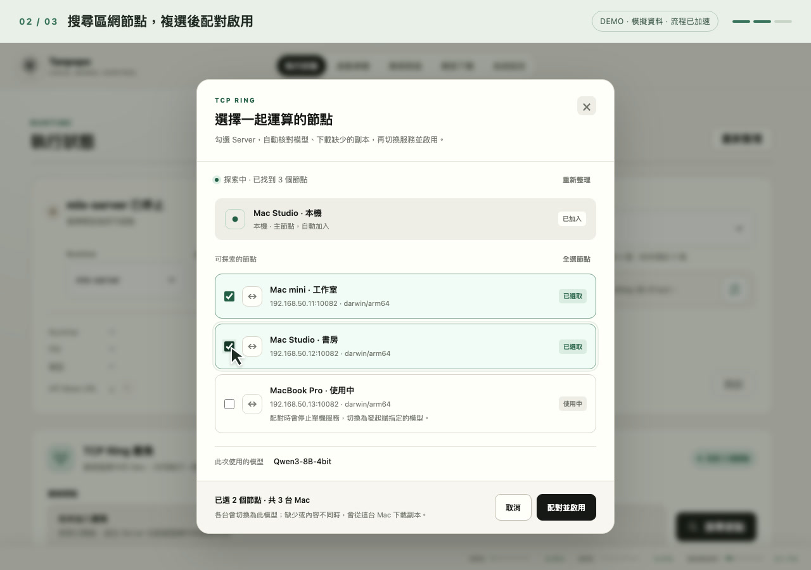

# MLX 分散推論與 RDMA 使用指南

狀態：實驗功能；2026-10-03。發行版 [1.26.1003 build 2049](releases/v1.26.1003-build-2049.md) 內附 `rdma11` Runtime；所有參與節點需更新完整 App／Server 後重新配對。

本功能讓多台 Mac 共同執行同一個模型。正式程式仍是 Go、Swift 與 C++，不需要 Python、pip 或 `mlx_lm.server`。

## 支援範圍

- TCP Ring 支援 2–8 個節點；JACCL RDMA 維持雙節點。Rank 0 提供 API、請求排程、Tokenizer、Attention、KV Cache 與抽樣；其餘 Rank 執行權重分片的線性層運算。
- 後端 `jaccl` 使用 MLX Core 的 Thunderbolt RDMA；`ring` 使用 TCP，兩者共用相同推論協定。Ring 測試成功不代表 RDMA 硬體已驗證。
- 模型能力直接取自原生 Runtime 的文字與影像模型註冊表，Server 與網頁不另維護架構白名單。各種來源共用同一個載入前掛鉤與線性層分片；輸入可為完整 safetensors 模型目錄、支援的 GGUF 或獨立 Fast GGUF。註冊不代表每種 checkpoint 都已驗證，啟動仍會檢查權重、切分計畫與記憶體預算。
- 通用演算法切分 `Linear`／`QuantizedLinear` 的輸出列，量化權重、scales、biases 與偏置使用相同列範圍。列數有餘數時，分片最多相差一列；通訊先補齊長度再移除暫存列，支援三台等無法整除的組合。輸出列數小於節點數的線性層留在主節點。
- 切分依據實際模組型別、形狀與可按列讀取的權重，不辨識模型檔名。只替換標準 `Linear`／`QuantizedLinear`；自訂子類別、載入時轉換而無法直接按列讀取的權重、專家層、卷積、Attention 及循環狀態保留在主節點。Qwen3.5 的 Gated Delta Net 與 MambaCache 沿用原本實作。
- 包裝後保留完整權重形狀與量化型別；一般 forward 使用分片，直接存取權重的融合運算則在主節點按需載入完整權重。這類操作會增加主節點記憶體需求，不能將分片層數或 `local_linear_bytes` 當作整個模型的實際記憶體占用。
- 主節點保留四個生成名額與每個請求獨立的取消、KV Cache、Prefill 及記憶體預算。單次遠端線性運算共用鎖，避免不同請求混用 collective 的順序與資料。
- 支援文字與影像模型；已註冊影像架構且附有 processor 設定時，自動選擇影像載入器，文字 checkpoint 仍走文字載入器。Server 的 `/api/chat/completions` 接受文字或 OpenAI 格式的 `text`／`image_url` 內容陣列；圖片使用 base64 data URL，單次最多 8 張，請求上限 32 MiB。GGUF／Fast GGUF 經原生轉換載入器接入相同分片機制；DFlash／MTP 的草稿生成保留在主節點，Target 驗證使用叢集。推測解碼仍須符合單機的模型／Draft 契約，不能任意混搭；管線平行仍不適用。MoE 等特殊架構僅分散其中的一般線性層，不會切分專家權重；若模型沒有可分散的線性層，會明確拒絕啟動。

此版本採每層輸入廣播與輸出匯集，通訊頻率較高。`rdma10` 重用控制張量及有限容量的 worker 零值緩衝區，降低每層反覆配置與 Metal 排程成本；模型同步也重用雜湊緩衝區，已有正確副本時省去模型庫掃描。完整 SHA-256 核對仍保留。量測與界線見[函式級最佳化報告](MLX-FUNCTION-OPTIMIZATION.md)，不能據此承諾雙機加速。

多台記憶體不會形成透明的共用記憶體。KV Cache、Embedding、Norm 及不能切分的部分仍由主節點負擔；可容納模型大小需以各節點實際預算判斷。

`rdma11` 進一步在載入安全策略時預先解析 IP 規則，並配合 Go／網頁的共用路徑最佳化，減少重複檔案查詢、連線及字串處理。基準條件、回歸與同機 Server Smoke 見[全專案函式最佳化報告](PROJECT-FUNCTION-OPTIMIZATION.md)。

## 建置

在專案根目錄執行：

```bash
./scripts/build-mlx-server-runtime.sh
./mlx-runtime/prebuilt/darwin-arm64/bin/mlx-server --distributed-capabilities
```

建置器沿用固定的 `mlx-swift 0.31.6` 與專案 Vendor fork，依序套用版本化的 Metal、分散式後端、TCP 連線診斷、收送佇列同步、socket 事件等待、分片讀取及矩陣加總順序補丁，不需升級整個 Swift MLX 依賴組合。

macOS SDK 包含 `infiniband/verbs.h` 時，自動編入 JACCL；較舊 SDK 只編入 Ring。建置 JACCL 需要 macOS 26.2 或以上的 SDK。未編入 JACCL 的成品不能用來驗證 RDMA，應更換工具鏈後重新建置。

`jaccl_library_available: true` 僅表示可載入後端，不能證明 RDMA 已啟用、線材正確或另一台已連線。`hardware_verified` 固定為 false，避免把本機探測冒充雙機驗收。

將同一份 Runtime 的**整個 `bin` 目錄**複製到另一台，包括 `mlx-swift_Cmlx.bundle`。兩台模型目錄內容也必須相同，可以位於不同絕對路徑。啟動會核對 Runtime 執行檔與模型內容的 SHA-256，再核對切分計畫。

正式建置以建置腳本為入口。自行執行 `swift test` 前，先執行一次建置腳本，以確保 SwiftPM checkout 已套用補丁。

TCP 連線診斷可用 `./scripts/smoke-mlx-distributed-sockets.sh` 驗證。此 Smoke 編譯實際套用補丁的 C++ socket 程式，檢查拒絕連線的原始錯誤碼、重試次數、回呼覆寫 `errno` 或拋出例外時的 socket 回收，以及正常連線。另以 ThreadSanitizer 驗證並行收送佇列，確認雙向斷線明確結束程序，並檢查接收等待中仍可加入傳送工作、輸出等待期間的 CPU 時間；不使用 Python。

## 在 Tanpopo Server 一鍵啟動 TCP Ring

此模式由 2–8 台 Tanpopo Server 各自管理一個原生 Runtime，不需要配對金鑰、SSH、Python 或手寫 Ring 設定檔。使用通用模型支援時，所有節點須一起更新 Server 與同一份 `rdma11` Runtime；舊版 Server 的模型檢查不會因只更新網頁而改變。`--distributed-capabilities` 必須回報 `ring_available: true`、`managed_parent_stdin: true`、`generic_linear_sharding: true`、`text_model_types`／`vision_model_types` 及足夠的 `max_ring_nodes`。

版本字串相同還不夠：自行編譯與正式簽署的 Runtime 執行檔可能不同，必須使用同一份完整成品。`rdma11` 不可與 `rdma10` 或更早版本混用。節點還須公布 `model_sync_version: 2`；只更新網頁不會加入模型同步能力。

1. 各台在「系統設定」指定可寫入的 MLX／GGUF 模型目錄；只需先在發起端準備要使用的完整模型。
2. 各台開啟「執行狀態 → TCP Ring 叢集 → 搜尋節點」，保持探索開啟。
3. 發起端選擇模型與 MLX 啟動參數，在對話框勾選 1–7 個節點，再按「配對並啟用」。勾選本身不改變服務；配對後會停止各台原有的單機服務，切換成此次模型。已加入另一叢集、版本不同或不支援同步的節點不可加入。
4. 發起端建立包含設定、Tokenizer、聊天範本、Processor 與權重的完整 SHA-256 清單。遠端先核對指定位置、同步快取與其他模型資料夾；內容一致即可使用，不要求資料夾名稱相同。
5. 找不到相同內容時，遠端透過管理 HTTP 向發起端下載到隱藏暫存目錄。逐檔比對大小與 SHA-256 後，才搬入 `cluster-models/<內容摘要>`。舊模型、不同量化版本及不一致的原檔一律保留；已驗證副本可供下次直接重用。這條路徑也適用手動匯入或自行量化模型，不猜測 Hugging Face repository，也不交換下載 Token。
6. 卡片顯示各台的核對／下載進度。背景工作不依附瀏覽器連線，可關閉對話框；按「停止叢集」會取消傳輸與回收租約。下載失敗不會發布半份模型。
7. 全部節點完成內容準備後，才協商並釋放 Ring 保留埠、啟動各 Rank。原生 Runtime 再核對執行檔、模型內容及切分計畫；就緒後從主節點對話。任一成員停止會清理整組。

主節點沿用選定參數的服務埠、Context、一般推論參數與 KV Cache 開關。工作節點收到模型識別、內容摘要、Context、成員及 Ring 端點；不接受對端指定任意命令、任意下載 URL 或執行檔路徑。GGUF 工作節點沿用發起端的轉換策略；模型與 mmproj 放在同一資料夾。Draft 只需存在主節點；工作節點不接受對端的 Draft 路徑或任意啟動參數。自訂分散式 CLI 參數仍須移除。

探索設定儲存在管理設定檔同層的 `data/cluster.json`，權限 `0600`，包含穩定節點 ID、探索開關、埠與網路介面，不再需要金鑰。舊版金鑰會忽略，重新儲存設定時移除。重開 Server 會恢復已啟用的探索，但推論需重新選取成員與配對，不會使用舊端點自動恢復。



圖中為真實介面搭配模擬節點；操作展示不代表實體多機或 RDMA 測試結果。

### 網路與交握

- UDP multicast 位址 `239.255.82.82`，預設埠 `10083`，TTL 1；每兩秒探索，12 秒未更新就移除節點。所有節點探索埠須相同。
- 預設探索可用 IPv4 介面，可在「網路設定」指定 `en0` 等介面並套用。同機測試可用 `lo0`；多網卡環境應選各端共同可達的介面。跨 VLAN、用戶端隔離 Wi-Fi 或封鎖 multicast 的網路不在自動探索範圍。
- 各台管理 HTTP 埠（預設 `10082`）必須互通；跨機時不能只監聽 `127.0.0.1`。Ring 自動配置各端非特權 TCP 埠，請允許 Tanpopo Server 與 mlx-server 區網連入。
- 探索協定升為 version 2，以 hello／challenge 回應核對往返可達性，控制連線只採實際來源 IP、已探索成員與固定管理路徑；時間戳、目的節點與 nonce 防止誤投與重放。新舊探索協定不互通，所有 Server 需一起更新。
- 此模式不使用共享金鑰或 HMAC，HTTP 握手及原生張量通道亦未加密；來源 IP 與 nonce 並非密碼學身分驗證。**僅適用信任的區域網路**；開啟探索即允許該區網已探索的 Server 邀請本機切換單機服務、下載指定模型副本並執行支援模型，關閉探索後不再接受邀請。
- 系統時間需相差不超過 30 秒。管理登入未啟用時，探索設定與啟動只接受本機操作；啟用管理登入後才能遠端管理。管理 API 仍有登入與跨來源檢查；節點控制 API 拒絕瀏覽器 Origin 與非 JSON 請求。
- 所有節點共用各自 Manager 的 GPU 保留，先保留再停止單機服務，阻止同時啟動或被另一群組搶用。任一成員啟動失敗會整組回滾；模型同步期間每 0.5 秒輪詢，啟動後每兩秒更新租約，任一端失聯超過 20 秒開始清理，正常停止預留最多八秒再強制結束。Server 意外退出時，原生程序會透過 stdin EOF 結束。此模式不會啟用 Thunderbolt RDMA。
- `rdma6` 修正 MLX socket 收送佇列的執行緒競爭；斷線或不可恢復的 I/O 錯誤會立即結束 Rank，交由 Server 回收整組。連線失敗保留原始系統錯誤碼並釋放 socket；張量逾時會標示 Rank、層、形狀、資料型別與通訊階段。Server 會將失敗節點與原因傳給其餘成員。若只看到叢集結束，請檢查兩端 Server 是否皆已更新，並參考 [TCP Ring 連線排查](MLX-RUNTIME-TROUBLESHOOTING.md#tcp-ring-配對後隨即結束)。

`rdma7` 在 socket 暫時無法收送時使用短暫 `poll` 等待事件，並在等待及 I/O 前釋放佇列鎖，避免持續呼叫 `recv(EAGAIN)` 耗用 CPU。poll 的等待期限設為 1 ms，以便及時處理新增的相反方向工作；不修改模型協定、權重校驗或故障期限。

### API 與同機三 Server Smoke

管理 API：`GET /api/cluster/status`、`PUT /api/cluster/config`、`POST /api/cluster/start`、`POST /api/cluster/stop`。探索設定只需 `enabled`、`discovery_port` 與 `interface`。啟動 JSON 使用 `peer_ids` 陣列（不含本機）、`model`、`startup_command_id` 及可選 `kv_cache_quantization_enabled`；另接受 `draft_model`、`dflash_enabled`、`fast_gguf_enabled`、`mmproj` 與 `conversion_confirmation_key`。轉換策略採發起端的 Server 設定。空白、重複、失聯或超出上限的選取會遭拒絕。`POST /api/cluster/start` 回傳 HTTP 202 表示已接受背景工作，不表示已載入模型。輪詢狀態中的 `session.phase` 與 `session.preparation`，同步失敗會清除 session 並保留 `last_error`。`POST /api/cluster/control` 是已探索節點間的控制協定；`POST /api/cluster/model` 只接受目前被選成員、符合來源 IP／nonce／session 的清單或檔案索引請求，不能讀取任意路徑。

```bash
TANPOPO_DISTRIBUTED_SMOKE=1 go test ./tests/distributed \
  -run 'TestTanpopoDiscoveredRingSmoke|TestNativeThreeRankCollectivesSmoke' \
  -count=1 -v -timeout 5m
```

此測試建立三個獨立 Go Server、各自設定／模型目錄與三個 Swift Runtime，使用真實 UDP multicast、免金鑰交握與正式管理 API。驗證單／三節點輸出及 Token 數一致、SSE、保留衝突、整組停止、同設定但不同權重的隔離下載、同內容不同目錄的重用、缺少整份模型時下載、Server 強制結束、父端 EOF、租約回收與重啟探索。另一項原生 Smoke 驗證三份無法平均分割的 FP32／FP16／BF16 一般與 Q4 線性層、完整權重直接存取、自訂線性子類別保留、四路交錯運算及 collective。

微型 safetensors fixture 由 Go 產生；測試的獨立設定關閉啟動前系統記憶體保留檢查，不改使用者設定。這可驗證同機完整流程；不同實體 Mac 的網路、防火牆、效能及 Thunderbolt RDMA 仍需設備到位後驗收。一般 Profile 的 `launch: "local"`／SSH 自動帶起 worker 仍限定雙節點，三個以上由各 Server 管理，或各 Rank 使用 `manual` 啟動。

### rdma8 模型同步與影像路徑

- 修正 macOS 將 `/var` 列舉為 `/private/var` 時，原生內容校驗錯把部分目錄名稱算入摘要的問題；摘要與模型資料夾名稱無關。
- Go Smoke 覆蓋完整內容核對、原檔保留、快取重用、錯誤下載、取消清理、路徑越界與未選成員拒絕；叢集生命週期使用 race detector 檢查。
- Qwen3.5-4B 真實影像模型在同一台 Mac 的兩個獨立 Server，透過圖片請求得到相同回答「這張圖片的主要顏色是紅色。」；單機與叢集皆為 28 個輸入、7 個輸出 Token，SSE 與整組停止通過。切分 346 層，每個 Rank 的線性權重為 1,333,287,424 bytes，主節點另有 367,572,480 bytes 常駐參數。這是功能 Smoke，不是雙實體機效能基準。
- 模型註冊表是可嘗試範圍，不是逐款認證。無可切分線性層、特殊算子或記憶體不足仍會明確拒絕；Fast GGUF raw 權重按列讀取，LZFSE 部分逐張量解壓到匿名暫存檔再按列讀取，不在每個 worker 常駐完整解壓權重。首次 GGUF 轉換仍沿用既有轉換器，須有足夠本機記憶體及磁碟空間；已有快取後才使用上述分片讀取。

### 重複執行本機多模型驗證

[模型驗證報告](MLX-CLUSTER-MODEL-VALIDATION.md) 記錄真實權重、架構微型案例與驗收界線。使用 [多模型 Smoke 工具](../scripts/smoke-mlx-model-matrix.mjs)，可讓同一套案例逐一比對單機與兩個獨立 Tanpopo Server。需要 Go、Node.js 與原生 MLX Runtime，無須 Python。

準備案例 JSON；`model` 是 `model_root` 內的相對目錄，圖片案例加上 `image: true`：

```json
{
  "model_root": "/path/to/models",
  "runtime": "/path/to/mlx-runtime/prebuilt/darwin-arm64/bin/mlx-server",
  "cases": [
    { "name": "文字模型", "model": "my-text-model" },
    { "name": "影像模型", "model": "my-vision-model", "image": true }
  ]
}
```

```bash
node scripts/smoke-mlx-model-matrix.mjs cases.json .cache/model-matrix-run

TANPOPO_DISTRIBUTED_SMOKE=1 \
TANPOPO_MLX_SERVER="$PWD/bin/mlx-runtime/prebuilt/darwin-arm64/bin/mlx-server" \
go test ./tests/distributed -run '^TestTanpopoDistributedSmoke$' -count=1 -v -timeout 5m
```

每輪須使用新的結果目錄。工具建立獨立設定、隨機埠與 `lo0` 探索，使用既有完整模型依序生成英文短句、中文多輪、跨 Prefill 區塊的長提示及選用的圖片。圖片預設為隨附的 56 × 56 純紅 PNG，也可用頂層 `image` 欄位指定另一張 PNG。固定 temperature 0、Context 4096、Prefill 128，逐項比對回答、推理內容、Token 數及結束原因；另比對 SSE 結果，並檢查兩端停止及 session 回收。錯誤與載入紀錄寫入結果目錄的 `result.json`，有任一失敗時以非零狀態結束。

Go 原生 Smoke 另使用固定數值的微型模型，涵蓋 Llama（F32／Q4／Q8）、Mistral、Phi3、Gemma2、Starcoder2、Qwen2、Qwen3、Qwen3 MoE 與 Qwen3.5 兩種設定格式。這些 fixture 可檢查合併投影、偏置、不同 Norm、混合精度及專家層保留；不是訓練完成的模型，不能當作對應所有真實 checkpoint 的認證。

### 函式耗時量測

在案例 JSON 頂層加入 `"benchmark": { "iterations": 5, "max_tokens": 48 }`，工具會在單機與叢集各暖機一次，再以固定中文提示量測五次，並逐筆核對回答、推理、Token 數及結束原因。`iterations` 可設 1–30，`max_tokens` 可設 16–256；未設定 `benchmark` 時維持一般 Smoke。

```bash
TANPOPO_DISTRIBUTED_PROFILE=1 \
node scripts/smoke-mlx-model-matrix.mjs cases.json .cache/function-profile-run

go test ./src/modelbundle -run '^$' \
  -bench 'Benchmark(CreateModelManifest|MatchModelManifest|EnsureExistingModel)$' \
  -benchmem -benchtime=500ms -count=5
```

量測期間請避免同時編譯、跑其他基準或使用 GPU。兩版使用相同提示、參數與量測開關；比較完整 HTTP 請求的耗時中位數，不能將同機雙 Rank 結果當作實體多機加速比。

`TANPOPO_DISTRIBUTED_PROFILE=1` 須在啟動 Server／原生 Runtime 前設定，預設關閉。啟用後，原生 `/health` 的 `distributed.function_profile` 提供 `control`、`input`、`gather` 的累積 `calls`、`input_bytes`、`input_eval_ms` 與 `collective_ms`；工具保存暖機後與量測後的快照。程序重啟即歸零，兩次快照的差值可能包含期間的心跳。

`input_eval_ms` 是 collective 前完成輸入張量求值的時間；`gather.input_eval_ms` 包含本地線性層運算。`collective_ms` 包含 CPU stream、傳輸與等待其他 Rank，不能視為純網路延遲；`input_bytes` 是本 Rank 傳入 collective 的張量大小，不能視為網卡傳輸量。worker 零值快取最多保留 16 MiB／32 筆，這是保留張量的上限，不是整個程序或 Metal allocator 的記憶體上限。

### 2026-10-03 較早版本驗證紀錄

- 兩台實體 Mac 使用同一份已發布的 `rdma4` Runtime，透過 Tanpopo Server 探索及交握，執行 `mlx-community/Qwen3-0.6B-4bit`（revision `73e3e38d981303bc594367cd910ea6eb48349da8`）。單機與雙機均回覆 `TCP Ring ready`，輸入 19、輸出 3 Token；健康資訊確認 `world_size: 2`。此項證明既有區網路徑可用。
- `rdma5` 以同機兩個獨立 Tanpopo Server 載入 `Qwen3.5-4B-MLX-4bit` 真實權重，經 UDP 探索及管理 API 啟動。切分 248 個線性層，每個 Rank 的線性權重為 1,003,806,720 bytes（原始總計 2,007,613,440 bytes）。兩組中英文回答及輸入／輸出 Token 數與單機一致，SSE、整組停止與租約清理通過。
- `rdma5` 實體雙 Mac 在遠端 App 完整結束再重啟後，恢復原生 TCP 連線。兩端使用 `lmstudio-community/Qwen3.5-4B-MLX-4bit` 固定 revision `c43ee1d65576a5d98de1e8405cac93c371a655c1` 的獨立副本後，通過 Runtime、模型內容與切分計畫校驗，248 個線性層載入就緒；第一筆推論仍發生張量運算 120 秒逾時，尚未通過雙機推論驗收。
- 同一實體區網的 `rdma5` Qwen3-0.6B 測試，第一組英文回覆及 Token 數與單機一致，但生成僅約 0.03 Token/s；第二組中文請求超過測試的 240 秒期限，未完成後續串流測試，已停止兩端測試程序。這項部分結果不等於整輪驗收通過。
- `rdma6` 原生三 Rank Smoke 驗證 FP32／FP16／BF16、Q4、直接讀取完整權重、自訂線性子類別及 lazy 權重轉換保留。三 Server Smoke 驗證探索、端點準備、交握回滾、故障及重啟回收。ThreadSanitizer 在修正前檢出 socket 佇列競爭，套用同步補丁後同項並行測試通過，連線錯誤與雙向斷線 Smoke 亦通過。
- `rdma6` 再以同機兩個獨立 Server 執行上述 Qwen3.5-4B 真實模型；中英文內容及 Token 數與單機相同，248 層分片、SSE、停止與叢集狀態回收均通過。這是同機流程驗證，不代表實體雙機已驗收。

- `rdma6`（build 1227）實體雙 Mac 在自動更新後，HTTP／探索可用，但原生 TCP 回報 `No route to host`（error 65）。遠端完整結束並從「應用程式」開啟後，恢復連線及模型載入；這是啟動方式的觀察差異，尚不能確定 macOS 內部原因。
- 同版 Qwen3.5 的短串流請求成功產生 `Qwen`（上限 2 Token），首內容約 9.7 秒、完成約 13.3 秒；完整非串流及串流請求仍發生不同層的 120 秒張量逾時，未通過整輪驗收。失敗期間，遠端記憶體約 58–60%。
- 在一次推論期間，遠端 1,040,706 bytes 靜態圖檔下載超過 20 秒；停止推論後同檔完成約 84 ms。此對照顯示一般 HTTP 也受影響，尚不能歸因於單一網路設備或模型。
- `rdma7` 的同項 ThreadSanitizer 測試、雙向斷線與等待中新增相反方向工作均通過。Socket 等待 1 秒的程序 CPU 時間由 `rdma6` 約 1.006 秒降為約 0.011 秒；這是等待成本測量，不能當作推論加速比。
- `rdma7` 原生三 Rank、同機三 Server Smoke，以及 Qwen3.5-4B 真實模型的同機雙 Server 中英文內容／Token 數比對、SSE 與停止回收通過。另以本機 TCP 代理加入每次讀取 8 ms 延遲、257 bytes 分段，完成固定 revision Qwen3.5 的 7 Token 回覆 `Qwen3.5 Ring ready`；此測試仍不能取代實體網路。

<a name="wifi-validation-1300"></a>

#### build 1300／rdma7 的 5 GHz Wi-Fi 實測補充

兩端分別為 M4 Pro／64 GB 與 M4／16 GB，使用相同正式簽署 Runtime。遠端完整結束並從「應用程式」開啟後，TCP、模型內容與分片計畫校驗恢復正常，但完整雙機推論仍未通過：

- Qwen3-0.6B 的英文非串流請求超過測試端 240 秒期限。Qwen3.5-4B 的完整 SSE 在約 12.5 秒產生第一個內容 `Q`，到 180 秒仍未完成；每 10 秒的 keep-alive 不算模型輸出。
- 遠端保持 Tanpopo 視窗在最前方後，同一 Qwen3.5 請求仍未在 180 秒內完成。單靠視窗前景／背景狀態，尚不能解釋這個現象。遠端兩個模型的單機短回覆均正常完成。
- 一次雙機推論期間的 20 個 Ping 沒有掉包，平均約 4.98 ms；原生 TCP 流量卻從每秒數 MB 降到約 500 bytes。低 GPU 使用率與等待資料的情況相符，但整機 GPU 指標不能直接代表某個 Rank 的運算占比。
- 後續雙機推論期間，56 與 1,472 bytes payload 的 Ping 各送 20 次，均有 5% 掉包，平均約 103／106 ms、最高約 386 ms。較大 payload 使用 IPv4 不分片選項，並非只有大封包失敗；短時間的健康狀態會改變。
- 停止兩端模型後，以同一條 HTTP 連線重複讀取 1,040,706 bytes 靜態圖檔，仍重現傳輸降速。一次累計完整接收約 89.5 MB 後逾時；另一次對照在第 59 筆圖檔只收到 149,612 bytes、15 秒未完成。後者可見 500／1,188 bytes 的間歇資料；同時建立的新連線也有 15 秒未完成的情況。
- 隨後使用版本化診斷工具，在同一 Wi-Fi 路徑完成 128 筆持續連線請求及 5 筆新連線對照，合計 138,413,898 bytes。量測工具未修改 App、Runtime 或網路設定；此成功紀錄顯示問題有間歇性，不能因前一次失敗就宣稱網路一定無法使用，也不能因後一次通過就宣稱已修復。
- 一般 HTTP 完整通過後，Qwen3.5 再次推論於約 23.5、35.0、46.0 秒分別產生 `Q`、`wen`、`3`，之後仍在 180 秒測試期限內未完成。測試結束後兩端模型程序已回收。

一般 HTTP 也重現異常，因此不能將目前失敗只歸因於模型架構、GPU 算力或 MLX。短 Ping／短下載正常也不足以證明長時間 TCP 傳輸正常。下一步需以同一組工具對照不同網路路徑；目前尚未確認故障位於哪台設備、網路元件或系統軟體，不會以延長推論期限代替驗收。

可用 [TCP 診斷工具](../scripts/diagnose-lan-tcp.mjs) 重複量測既有 HTTP 長連線與新連線，記錄部分傳輸量、資料間隔與整筆期限；操作方式見 [區網傳輸與 GPU 使用率排查](MLX-RUNTIME-TROUBLESHOOTING.md#tcp-ring-低-gpu-使用率與傳輸降速)，詳細數據見 [去除位址與主機名稱的驗證紀錄](validation/tcp-ring-wifi-2026-10-03.json)。

以上不是效能基準：每層通訊仍有明顯成本，不能宣稱 `rdma7` 已解決實體逾時。Thunderbolt JACCL RDMA 尚未實測。

## JACCL 設備前置作業

JACCL 需要兩台具備 Thunderbolt 5 的 Apple Silicon Mac，均執行 macOS 26.2 以上，並以 Thunderbolt 5 線直接連接。

每台需由使用者進入 Recovery，於終端執行 `rdma_ctl enable`，重新開機後確認：

```bash
ibv_devices
ibv_devinfo
```

依實際連線找到各自的 `rdma_en*` 裝置，確認連線為 `PORT_ACTIVE`。裝置名稱不保證兩台相同；更換插孔後需要重新核對。

另保留可達的管理網路，用於 SSH 與 JACCL Coordinator。依官方 MLX 流程停用 Thunderbolt Bridge、配置各條 Thunderbolt 連線的網路位址，並避免主機睡眠。程式不會代替使用者變更 Recovery、網路介面或睡眠設定。

Coordinator 與 RDMA 連線應位於受信任的網路。遠端啟動採用既有 SSH 金鑰與已確認的 host key，不停用主機身分驗證，也不儲存 SSH 密碼。

依據：[Apple TN3205](https://developer.apple.com/documentation/technotes/tn3205-low-latency-communication-with-rdma-over-thunderbolt)、[MLX 分散式設定](https://ml-explore.github.io/mlx/build/html/usage/launching_distributed.html)。

## 雙機設定

在主節點建立例如 `/Users/yourname/cluster.json`。以下位址、裝置名稱、帳號及路徑均需依設備調整：

```json
{
  "version": 1,
  "backend": "jaccl",
  "coordinator": "192.168.20.10:5500",
  "operationTimeoutSeconds": 120,
  "startupTimeoutSeconds": 600,
  "nodes": [
    {
      "rdmaDevice": "rdma_en2"
    },
    {
      "rdmaDevice": "rdma_en3",
      "ssh": "yourname@mac-b",
      "runtimePath": "/Users/yourname/tanpopo-runtime/bin/mlx-server",
      "modelPath": "/Users/yourname/services/mlx-models/your-model"
    }
  ]
}
```

- 陣列順序代表 Rank；主節點永遠是第一筆。
- `coordinator` 是主節點可供另一台連入的 IPv4 與連接埠，不接受 `0.0.0.0`、DNS 名稱或 IPv6。通訊連接埠需在 1024–65535。
- 第二筆的 `ssh` 可以是 SSH config 的 Host 別名或 `user@host`。需事先在主節點確認免互動的 SSH 登入可用。
- 填寫 `ssh` 時，Rank 0 自動啟動另一台 Runtime，透過參數傳遞設定；不需要先在另一台建立同路徑的設定檔。
- `launch` 可指定 `ssh`、`local` 或 `manual`。省略時，有 `ssh` 欄位就採 SSH，否則為手動啟動；`local` 的單機模擬方式見下方。
- 手動啟動時，兩台各自準備相同設定內容，並指定 `--distributed-rank 0`／`1`。
- 啟動預設最多等待 600 秒，通訊運算預設最多等待 120 秒。大型模型內容校驗及載入較久時，可調整 `startupTimeoutSeconds`，最大 7200 秒。

先做不需要模型的原生通訊與數值 Smoke：

```bash
/path/to/bin/mlx-server \
  --distributed-config /Users/yourname/cluster.json \
  --distributed-smoke
```

此命令會使用相同 SSH 啟停流程，在兩台執行 collective、不同資料型別、一般／量化線性層、四路交錯運算、健康檢查及停止測試。

通過後啟動模型：

```bash
/path/to/bin/mlx-server \
  --model /Users/yourname/services/mlx-models/your-model \
  --distributed-config /Users/yourname/cluster.json \
  --host 127.0.0.1 --port 8080
```

由 Tanpopo 管理時，在 MLX 啟動參數的「額外參數」加入：

```text
--distributed-config /Users/yourname/cluster.json
```

然後選擇相容的原生 MLX 模型並啟動。管理器控制主節點，主節點管理本機或 SSH worker；受管模式不接受 `--distributed-rank` 等內部參數。

`/health` 與 `/props` 會回報 `distributed` 資訊，包括實際後端、群組大小、分片層數、本地線性層權重位元組數與主節點保留部分。只有模型核對、分片載入及雙節點健康檢查成功後才開放 API。

## 載入、容量與故障處理

權重使用 MLX Core lazy Load 的列範圍讀取：先套用模型結構，再直接讀取本 Rank 的線性層列。即使 safetensors 不符合 mmap 對齊，也不先將整個線性 tensor 複製進記憶體。分散式模式的權重讀取策略優先於一般 mmap 選項；若設定 mmap reserve，仍沿用其本機記憶體保留限制。

Go 啟動前保留系統記憶體的檢查仍有效；完整模型檔案大小不能代表本機分片，故該部分交由 Runtime 在分片配置前驗證。每個節點預留通訊暫存，主節點的請求仍受既有 KV 與 Prefill 記憶體檢查約束。程式不會自動把兩台實體 RAM 相加作為可用預算。

主節點每 10 秒送出健康探測。Worker 等待主節點的期限是 `max(60, operationTimeoutSeconds × 2)` 秒；單次運算另有自己的期限。無法恢復的通訊錯誤或逾時會終止該 Rank，需重新啟動整個服務。本機及 SSH worker 都監控父端 stdin EOF，避免主節點結束後遺留程序。

一般請求取消只停止主節點對應的生成工作，已送出的線性層運算先收尾；worker 不保存請求狀態，所以不會取消其他使用者的 KV Cache。節點或連線故障則影響整個分散式服務，不能保證既有請求不中斷。

## 單機雙節點，直接由 Tanpopo Server 管理

以下設定讓 Tanpopo 的正常啟動路徑自動帶起兩個原生 Runtime，不需要 SSH、Python 或手動開第二個終端：

```json
{
  "version": 1,
  "backend": "ring",
  "operationTimeoutSeconds": 120,
  "startupTimeoutSeconds": 600,
  "nodes": [
    { "ringAddress": "127.0.0.1:5500" },
    { "ringAddress": "127.0.0.1:5501", "launch": "local" }
  ]
}
```

將設定存成絕對路徑的 JSON，在 MLX Profile 額外參數加入 `--distributed-config /絕對路徑/local-cluster.json`，再從 Tanpopo 啟動相容模型。Server 啟動 Rank 0，Rank 0 直接啟動 Rank 1，兩者使用同一份 Runtime 及模型。停止模型或關閉 Server 時會回收兩個程序；關閉 Server 前仍在執行的模型，重開時沿用原 Profile 自動恢復。

`local` 只接受 loopback TCP Ring，不可混用 SSH 或 JACCL。若需要驗證不同目錄，可在第二筆指定絕對 `modelPath`；兩份模型仍會核對內容。兩個程序共用這台 Mac 的實體記憶體與 GPU，適合功能 Smoke，不代表有兩台機器的容量或效能。

## Go 原生完整服務 Smoke

在專案根目錄執行：

```bash
./scripts/build-mlx-server-runtime.sh
TANPOPO_DISTRIBUTED_SMOKE=1 go test ./tests/distributed \
  -run TestTanpopoDistributedSmoke -count=1 -v -timeout 12m
```

測試由 Go 編譯並啟動真正的 Tanpopo Server，以管理 API 建立 Profile，再由 Server 啟動單機或雙節點模型。Go 直接產生微型 safetensors 與 Tokenizer，沒有模型下載、Python、pip 或虛擬環境。指定其他 Runtime 成品時，可設定 `TANPOPO_MLX_SERVER=/絕對路徑/bin/mlx-server`。

所有帳密、API Key、設定、模型與連接埠均在獨立暫存環境建立；不修改現有 `agent.properties` 或 `data`。固定微型資料的 Smoke 沿用預設關閉的 Go 啟動前記憶體壓力檢查，避免其他桌面工作的負載影響流程驗證；Runtime 的分片與請求預算仍生效。系統記憶體保留的檢查另由 `src/llamacpp` 測試驗證。此測試需 macOS Apple Silicon；一般 `go test` 未設定啟用旗標時會略過。

涵蓋的實際流程：

- 管理登入、模型 API Key、Profile 建立、啟動與就緒狀態。
- Llama、Qwen2、Qwen3、Qwen3.5、Qwen3.5 Text 的單機／雙節點 Chat 輸出與 Token 數、分段長 Prefill、SSE。Qwen3.5 fixture 同時含循環與完整注意力層。
- 經 Go 聊天代理四人受理、一般／SSE 第五人回傳 429、取消隔離及名額回收。
- Runtime 的 401／429 保留原有語意；模型金鑰失敗不會讓網頁誤判管理登入失效。
- 主節點／worker 故障回報、父端 EOF、停止回收、Server 重開自動恢復。
- 缺少節點的啟動期限、模型內容不一致及管理狀態回報。
- 原生 collective、FP32／FP16／BF16、一般／Q4 線性層及四路交錯運算。

真正設備到位後，仍需驗證 JACCL 的數值結果、長時間穩定性、線材中斷／worker 結束後回收，以及大型模型的首 Token 延遲、生成速度、逐節點記憶體與 CPU 使用量。本機 Ring 通過不能替代這些驗收。

## GGUF 與推測解碼的叢集設定

- 在一般 GGUF 清單選模型；`gguf:` 前綴對應 GGUF 根目錄，safetensors 使用 MLX 根目錄。API 也接受 `gguf:目錄/模型.fgguf.json`，不需要保留來源 GGUF 才能載入獨立 Fast GGUF。
- 「快速 GGUF」開關與轉換策略由發起端決定，各節點使用相同策略。首次轉換沿用轉換容量確認；工作節點在本次配對授權下建立自己的快取，停止後保留供下次使用。叢集期間不自動移除來源 GGUF。
- 同步清單含選定入口、完整雜湊與必要資產。Fast GGUF 只傳 manifest 指定的分片與啟動資產；GGUF 包含選定權重、mmproj 與設定／Tokenizer，不會順帶傳送同目錄其他大型模型。
- CLI 自動啟動 local／SSH worker 時，與 Target 同目錄的 mmproj 會依 worker 的 `modelPath` 對應至其模型目錄。若刻意將 projector 放在其他位置，需讓該絕對路徑在兩端皆可使用，或手動啟動各 Rank 並分別指定 `--mmproj`。
- DFlash 請在進階設定開啟並選用相容的 safetensors Target／Draft；MTP 使用既有 MTP 啟動參數與相容 Draft，或含原生預測層的 GGUF。KV 量化與推測解碼互斥。Fast GGUF fallback 尚未保存內嵌 MTP 預測層，仍需原 GGUF。
- 草稿模型、抽樣與 KV 由發起端持有。加入節點不會擴大 Draft 的相容模型範圍，也不代表所有運算都會分散。

[本機格式與推測解碼驗證](MLX-CLUSTER-FORMATS-VALIDATION.md) 提供實際案例及限制。重跑多模型工具時，可在案例加上 `launch`（與啟動 API 欄位相同）、`extra_args` 與 `speculative: "dflash"`／`"mtp"`；工具會檢查草稿提案、標準解碼比對、SSE 及停止回收。可用 `worker_model_root` 指定空的工作節點模型目錄，驗證真正的檔案下載。
